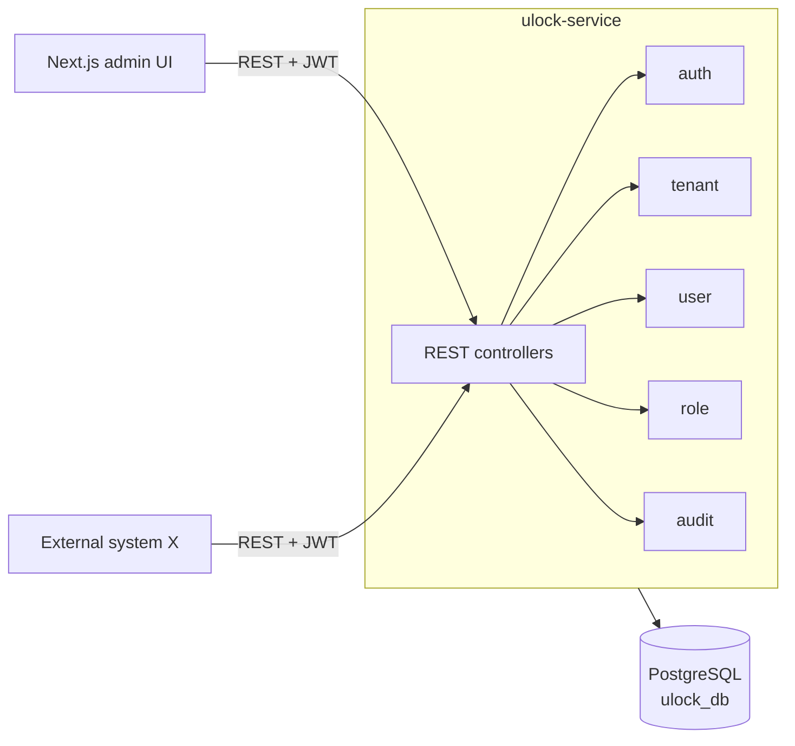
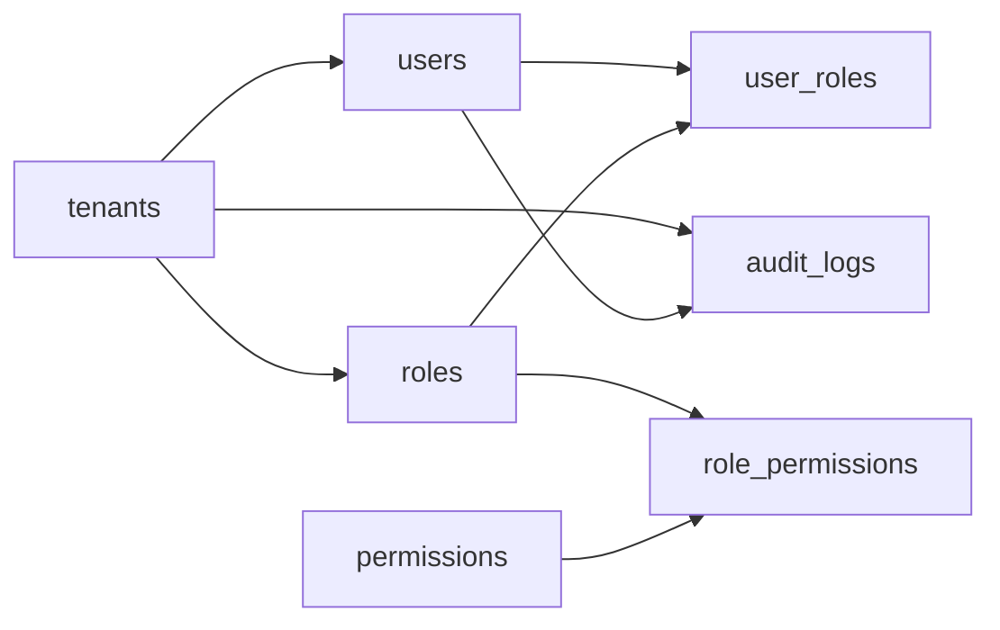

# uLock Service — Engineering Requirements Document

Sep 23, 2026 · @Benho

## Overview

uLock (`ulock-service`) is the multi-tenant access control service for the platform: it authenticates users and answers "is this user allowed to do this?" using RBAC. It is the first service in the microservice landscape, so its conventions set the pattern for the services that follow.

- **Consumers:** external systems (other services) over a RESTful API, and a Next.js admin frontend.
- **Audience of this doc:** engineers building and reviewing uLock.
- **Scope of v1:** authentication, authorization checks, tenant, user and role management, access summaries, and audit logs.

## Goals and non-goals

The goal is a simple, flat RBAC service that any other service can call to authenticate a user and check a permission within a tenant.

**Goals**

- One central place for identity, roles and permissions across all tenants.
- Strict tenant isolation: no data from one tenant is ever visible to another.
- A full audit trail of who did what, per tenant and per user.
- A clean REST API that other services can integrate with in under a day.

**Non-goals (by design)**

- No organizational hierarchy (departments and their employees).
- No user groups; roles are assigned to users directly.
- No database per tenant; all tenants share one database.
- No migration from an existing legacy system in v1.
- No ABAC or policy engine; RBAC only.

## Functional requirements

Seven requirements make up v1; each maps to one feature package in the codebase.

| ID | Requirement | Details | Package |
| --- | --- | --- | --- |
| FR-1 | Authentication | Users log in with email + password per tenant; uLock issues a signed access token and a refresh token; logout revokes the refresh token. | `auth` |
| FR-2 | Authorization check | External systems ask whether a user holds a permission in a tenant; uLock answers allow or deny. | `auth` |
| FR-3 | Tenant management | Platform admins create, update, deactivate and list tenants. | `tenant` |
| FR-4 | User management | Tenant admins create, update, deactivate and list users in their tenant, and reset passwords. | `user` |
| FR-5 | Role management | Tenant admins define custom permissions, create roles, attach permissions, and assign or revoke roles for users. | `role` |
| FR-6 | Access summary | For any user: their roles and the resulting effective permissions; for any role: its permissions and members. | `role` |
| FR-7 | Activity logs (auditing) | Every login, failed login and admin change is recorded; logs are viewable and filterable per tenant and per user. | `audit` |

A user belongs to exactly one tenant. Email is unique within a tenant, not globally.

## Non-functional requirements

Authorization checks sit on the hot path of every other service, so latency and availability targets are the strictest.

| Area | Requirement |
| --- | --- |
| Latency | Authorization check p95 < 50 ms; admin APIs p95 < 300 ms. |
| Availability | 99.9% monthly for authentication and authorization endpoints. |
| Scalability | Stateless service, horizontally scalable behind a load balancer. |
| Security | OWASP Top 10 covered; passwords hashed with BCrypt or Argon2; TLS everywhere. |
| Tenant isolation | Every query is scoped by `tenant_id`; cross-tenant access is covered by automated tests. |
| Auditability | Audit records are append-only and kept for at least 1 year. |
| Observability | Structured JSON logs with trace IDs, Actuator health and metrics, Prometheus-compatible. |
| Maintainability | Test coverage ≥ 80% on service and domain code; CI runs on every pull request. |

## Architecture and key decisions

uLock is a single Spring Boot service with one shared PostgreSQL database, organized by vertical feature slices.

Clients call the REST API; each feature slice owns its controller, service, repository and entities, and all slices share one database.

| Decision | Choice | Why |
| --- | --- | --- |
| Multi-tenancy | Shared DB, `tenant_id` column | Simplest to run and migrate; per-tenant DBs add ops cost with no v1 benefit. |
| Authorization model | Flat RBAC | Matches the requirements; hierarchy and groups are explicit non-goals. |
| API style | RESTful, JSON, `/api/v1` | Widest client support; easy for external systems to adopt. |
| Code structure | Vertical slicing (package by feature) | A change to one feature stays in one package; slices can be extracted later. |
| Backend | Java 21, Spring Boot 3.x, Maven | Team stack; mature security ecosystem (Spring Security). |
| Persistence | PostgreSQL 16, Spring Data JPA (Hibernate), Flyway | Standard Spring choice; Flyway versions the schema. |
| Frontend | Next.js (separate repo) | Admin UI for tenants, users, roles and logs. |
| Legacy migration | None in v1 | Greenfield system. |

## Data model

Seven tables in `ulock_db`: the five on the whiteboard plus `permissions` and `role_permissions`, which RBAC needs to express what a role can do.

| Table | Key columns | Notes |
| --- | --- | --- |
| `tenants` | `id` (UUID), `name`, `slug`, `status`, `created_at`, `updated_at` | `slug` unique; status ACTIVE or SUSPENDED. |
| `users` | `id`, `tenant_id`, `email`, `password_hash`, `full_name`, `status`, `last_login_at`, timestamps | Unique (`tenant_id`, `email`). |
| `roles` | `id`, `tenant_id`, `name`, `description`, timestamps | Unique (`tenant_id`, `name`). |
| `permissions` | `id`, `tenant_id` (null = system permission), `code`, `description`, timestamps | System permissions (e.g. `user:read`) plus tenant-defined ones (e.g. `invoice:approve`). Unique (`tenant_id`, `code`); a role may only use system permissions or its own tenant's. |
| `role_permissions` | `role_id`, `permission_id` | Composite primary key. |
| `user_roles` | `user_id`, `role_id`, `assigned_by`, `assigned_at` | Composite primary key; both sides in the same tenant. |
| `audit_logs` | `id`, `tenant_id`, `actor_user_id`, `action`, `target_type`, `target_id`, `details` (JSONB), `ip_address`, `created_at` | Append-only; index on (`tenant_id`, `created_at`) and (`actor_user_id`, `created_at`). |

Arrows point from parent to child (one-to-many). All primary keys are UUIDs; all timestamps are `timestamptz` in UTC.

## API design

All endpoints live under `/api/v1`, use JSON, and return errors as RFC 7807 `ProblemDetail`. Tenant-scoped resources carry the tenant in the path.

| Method | Path | Purpose | FR |
| --- | --- | --- | --- |
| POST | `/auth/login` | Log in, returns access + refresh tokens | FR-1 |
| POST | `/auth/refresh` | Exchange refresh token for a new access token | FR-1 |
| POST | `/auth/logout` | Revoke the refresh token | FR-1 |
| POST | `/authz/check` | Body: tenantId, userId, permission; returns allow/deny | FR-2 |
| POST, GET | `/tenants` | Create, list tenants | FR-3 |
| GET, PATCH | `/tenants/{tenantId}` | Get, update or suspend a tenant | FR-3 |
| POST, GET | `/tenants/{tenantId}/users` | Create, list users | FR-4 |
| GET, PATCH | `/tenants/{tenantId}/users/{userId}` | Get, update or deactivate a user | FR-4 |
| POST, GET | `/tenants/{tenantId}/roles` | Create, list roles | FR-5 |
| GET, PATCH, DELETE | `/tenants/{tenantId}/roles/{roleId}` | Manage a role | FR-5 |
| PUT | `/tenants/{tenantId}/roles/{roleId}/permissions` | Replace a role's permissions | FR-5 |
| POST, DELETE | `/tenants/{tenantId}/users/{userId}/roles/{roleId}` | Assign, revoke a role | FR-5 |
| GET | `/tenants/{tenantId}/users/{userId}/access-summary` | Roles + effective permissions | FR-6 |
| POST, GET | `/tenants/{tenantId}/permissions` | Create, list permissions (tenant-defined + system) | FR-5 |
| GET | `/tenants/{tenantId}/audit-logs` | Filter by userId, action, from, to | FR-7 |

List endpoints are paginated (`page`, `size`, `sort`). Breaking changes go to `/api/v2`.

## Security model

uLock issues short-lived JWT access tokens and enforces tenant isolation on every request.

- **Tokens:** access token = JWT signed with RS256, 15-minute lifetime, claims `sub` (userId), `tid` (tenantId), `roles`. Refresh token = opaque, 7-day lifetime, stored hashed, rotated on each use.
- **Key distribution:** uLock exposes its public keys at `/.well-known/jwks.json`, so other services can verify tokens locally without calling uLock.
- **Tenant isolation:** the `tid` claim must match the `{tenantId}` in the path; mismatches return 403 and are audited. Repositories always filter by `tenant_id`.
- **Roles for uLock itself:** `PLATFORM_ADMIN` (manages tenants), `TENANT_ADMIN` (manages users and roles in one tenant), `TENANT_AUDITOR` (reads audit logs).
- **Passwords:** BCrypt (cost 12) or Argon2id; minimum 10 characters; account lock after 5 failed logins in 15 minutes.
- **Service-to-service:** external systems call `/authz/check` with a client-credentials token (a machine client per system).
- **Transport:** TLS only; CORS limited to the Next.js origin.

## Testing, conventions and open questions

**Testing**

- Unit tests (JUnit 5, Mockito) for services and domain logic.
- Integration tests with Testcontainers PostgreSQL for repositories and full API flows.
- A dedicated tenant-isolation test suite: every tenant-scoped endpoint is called with a token from another tenant and must return 403.

**Conventions**

- Service name `ulock-service`; base package `com.yourcompany.ulock`; main class `ULockApplication`.
- Packages by feature: `auth`, `tenant`, `user`, `role`, `audit`, `common`.
- Database objects in snake\_case; migrations as `V<n>__<description>.sql` in Flyway.
- DTOs as Java records; entities never returned from controllers.

**Open questions**

- [x] Does uLock issue tokens itself, or should it sit behind an identity provider such as Keycloak? Answer: uLock is the identity provider (IdP) and issues its own tokens.
- [x] Is the permission catalog fixed by uLock, or can tenants define their own permissions? Answer: tenants define their own permissions, alongside built-in system permissions.
- [x] How long must audit logs be kept for compliance? Answer: 1 year.
- [x] Do external systems need bulk authorization checks (many permissions in one call)? Answer: no, single checks only in v1.
